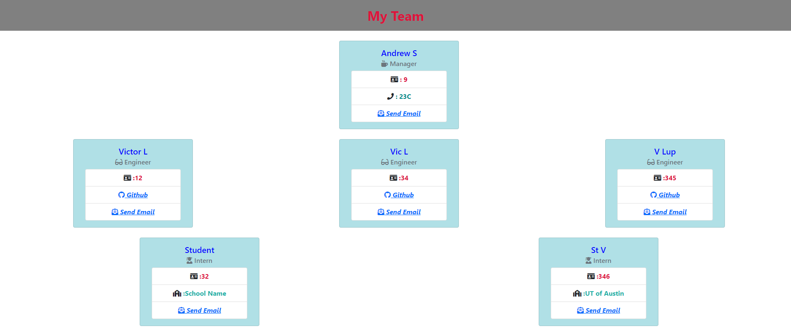

# Team-Profile-1-2-3

[](https://opensource.org/licenses/MIT) 
___
## Description
Node.js command-line application that takes in information about employees on a software engineering team and generates an HTML webpage that displays summaries for each person.
___
## Table of Contents
* [Installation](#installation)
* [Usage](#usage)
* [Test](#test)
* [Contributing](#contributing)
* [License](#license)
* [Deployment](#deployment)
* [Questions?](#questions)
___
## Demo



___
## Installation
The application requires Node.js. Clone the repo on your local machine. In the terminal navigate to root and run 
```js 
npm i
```


___
## Usage
If followed the installation instructions, then in the terminal run 
```js 
node index
```
Answer the prompts. After check 'dist' folder and open the 'index.html' in your browser.


___
## Test
To run tests on the app, in the command line run 
```js
npm test <test-file-name>
```


___
## Contributing
Big thanks to UT BootCamp Instructional Team

___
## License
[MIT](https://choosealicense.com/licenses/)
___
## Deployment
View the deployed page at : See GitHub link in the Questions section
___
## Questions?
Contact Me:
* Github: https://github.com/vitokwolf/Team-Profile-1-2-3
* Email: sinajeen@gmail.com
